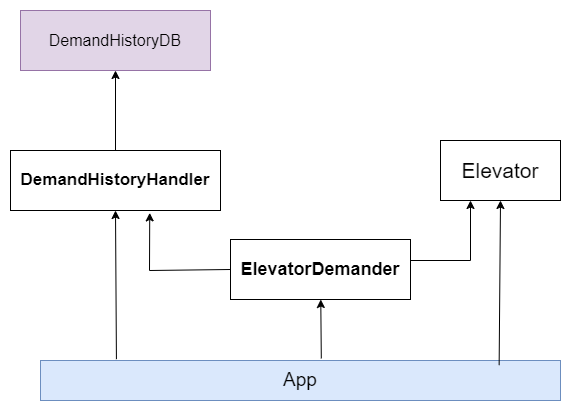

# Citric Elevator - devtest
___
### Description
This project is a simple API that simulates an elevator system. The main focus is to provide a way to collect and supply
data to feed a prediction training algorithm for the task of predicting the likely next floor based on historical demand.

It was developed using FastAPI and Python 3.12.




### Requirements
- Python 3.12
- uvicorn
- fastapi
- httpx
- pydantic
- pytest
- pytest-asyncio
- sqlite3

### Running the Project
1. Clone the repository
2. Install the dependencies
3. Run the server
```shell uvicorn main:app --reload --port <PORT>```
4. Access the documentation at http://localhost:\<PORT>/docs to consume the API

 #### Running the Tests
Two frameworks were used to run the tests: unittest and pytest. The first one was used to run 
the unit tests and the last one to run the integration tests. To run the tests, follow the steps below:
1. Run unit tests
```shell  python -m unittest discover -s test```
2. Run integration tests
```shell pytest test/test_main.py```
---
### Future Improvements
- [ ] Improve Elevator's dynamic - currently it is a very simple elevator that does not consider any type of concurrency. 
It would include removing the simulation of user input and also split call dynamic to better represent the real 
dynamic of an elevator use.
- [ ] Turn the Elevator into an entity in the database - it would provide the possibility of having multiple elevators 
in the system.
- [ ] Improve integration tests - currently they only verify the http response, but it would be interesting to verify 
the system state after the requests. It also would be necessary to include unsuccessful requests.
- [ ] Improve the demand history query with pagination - this would avoid performance issues and also provide a more 
manageable way to consume the data.
- [ ] Investigate the possibility of using only one test framework.
